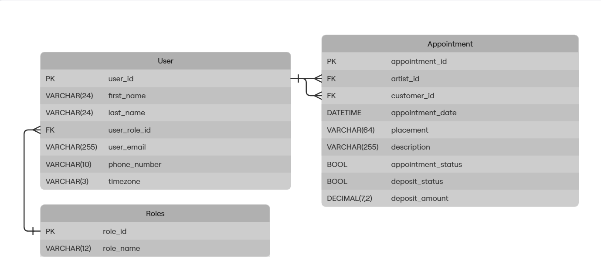

# Schedule Buddy

## What it is
Scheduling Buddy is an application to help artists streamline their scheduling. Many artists spend just as much
time managing their schedule as they do creating the art, and this application's goal is to help mitigate that. This app
is designed to keep track of deposits, keep track of the status of appointments, and provide a "one-stop shop" for
managing scheduling.
## Architecture
*NOTE: User Architecture is Temporary while in infancy stages. Will be adding login functionality later*

## How to Run
Currently, this application has not been containerized as it is in its infancy stages. Once the application has matured
a little bit this will be containerized to run in docker on a kube cluster. Currently running the application is as easy
as running the app in your chosen IDE.
